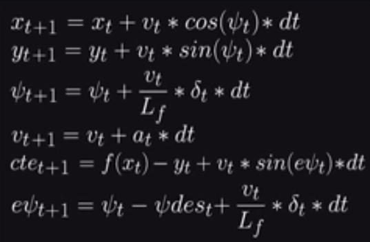
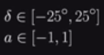

# Model Predictive Control

## Simulation Results

The car is able to complete lap around the track given a reference trajectory
by estimating waypoints (by fitting a polynomial to the trajectory) and
finding optimal sequence of actuations (using Ipopt solver) to achieve a smooth ride.

## The Model

### State
State of the system contains following five attributes:

- (x, y)  coordinates of position of car
- Car orientation compared to reference trajectory $\psi$
- Cross track error
- Error in car orientation with respect to reference trajectory

### Actuators
The car's motion is controlled via throttle and steering angle as actuators.

### Update Equations

### Constraints

### Objective

The objective is to achieve a smoother ride while staying close to the reference
states of trajectory and velocity by:

- Minimizing the use of actuators.
- Minimizing the value gap between sequential actuations inorder to avoid a jerky
  ride (i.e. to get a smoother transition between states)
- Minimizing total changes in state

### Latency

Latency is handled by applying update equations (see above) to the  current state to estimate car state 100ms in future.
